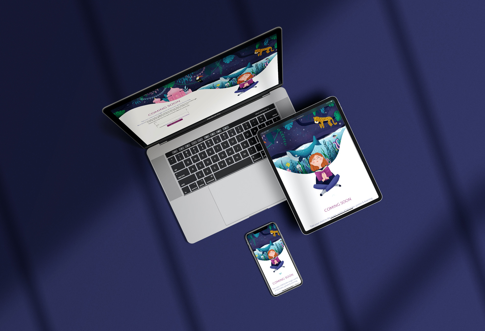

# Landing Page
Blue Snail Landing Page est une page de renvoi que j’ai créée pour ma future application Blue Snail. Elle a pour but d'inscrire les internautes intéressés sur la mailing liste afin de pouvoir les informer dès que l’application est disponible.

Cette page, ainsi que ce site internet, sont totalement responsives. J’ai codé les deux sans intégrer ni framework ni bibliothèque externe, car j’ai voulu relever un défi : utiliser CSS pur et rendre la page responsive grâce au flexbox.   
  
**Leins :**  
  
[Voir la page](https://bluesnailapp.com/landingpage/)  
  
**Aperçu :**  
  
  
  
  
